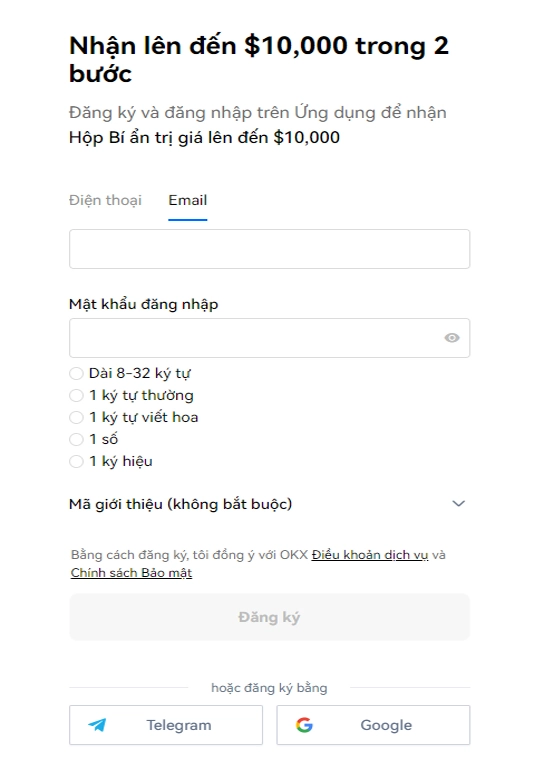
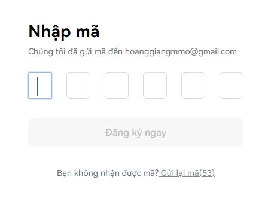
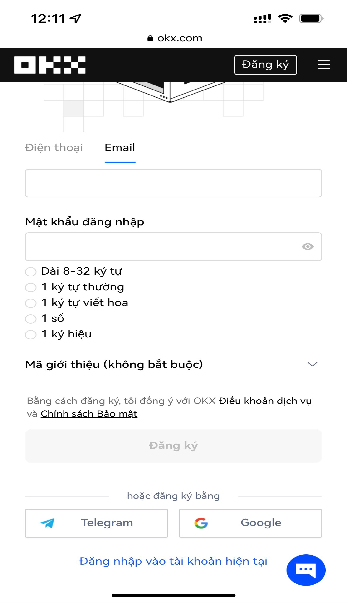

# How to Register on OKX Exchange and Complete KYC Verification: Complete A-Z Guide

Looking to start your crypto trading journey but stuck at the registration stage? This comprehensive guide walks you through creating your OKX account and completing identity verification on both mobile and desktop—no technical expertise required. Whether you're a complete beginner or switching from another platform, you'll have your account ready to trade in minutes.

---

## Why Start with OKX Registration?

Setting up an OKX account opens the door to one of the world's most reliable crypto exchanges. The process is surprisingly straightforward—you can register using just your email or phone number. No complicated paperwork, no hidden fees during signup, and you'll be ready to explore trading, staking, and earning opportunities right away.

## Video Tutorial: Register OKX on Mobile

## Creating Your OKX Account on Desktop

Head over to the official OKX website and look for the registration button. You'll see two options staring back at you: phone number or email. Pick whichever feels more convenient.

**If you're going with phone registration:**
- Select your country code (+84 for Vietnam, for example)
- Type in the last 9 digits of your number
- Skip that leading zero—the country code already covers it

**Choosing email instead?**
- Just enter your primary Gmail address

Now for the password. This one's important. OKX wants something secure: 8-32 characters mixing lowercase letters, uppercase letters, numbers, and at least one special character like @, *, #, or %.

There's an optional referral code field. You can leave it blank, or if you'd like, use code **47044926** to get started with some bonus perks.

Hit that Sign Up button and you're almost there.

**Quick tip:** Not feeling the traditional signup? OKX lets you register instantly through your Telegram account or Google Gmail. The buttons are right below the main form.      

Check your inbox for the verification code. OKX just sent one to whatever email you registered with. Copy that code and paste it into the verification box.

## Setting Up OKX on Your Phone

The mobile process mirrors the desktop version almost exactly. 👉 [Start your mobile registration here with exclusive trading benefits](https://www.okx.com/join/47044926) and follow the same steps—enter your phone or email, create a secure password, and verify your account.

  

The beauty of mobile registration? You can complete everything while waiting for your coffee. The app handles verification codes automatically in some cases, making the whole process even smoother.

## Completing KYC Verification on OKX

After registration comes identity verification—KYC, as it's called in the crypto world. This step ensures your account stays secure and unlocks higher withdrawal limits. OKX walks you through it with clear instructions, usually requiring a government-issued ID and a quick selfie for verification.

The platform guides you through each step, and most verifications complete within minutes. You'll need your ID handy (passport, driver's license, or national ID card), decent lighting for the selfie portion, and a stable internet connection. That's really all there is to it.

---

## Ready to Trade?

You've now got your OKX account registered and know exactly how to handle KYC verification. The whole setup takes less time than making dinner, yet it opens up a world of crypto trading opportunities. 👉 [Complete your OKX registration now and unlock advanced trading features](https://www.okx.com/join/47044926) to start exploring spot trading, futures, staking, and more—all from one secure platform designed for both beginners and experienced traders.
